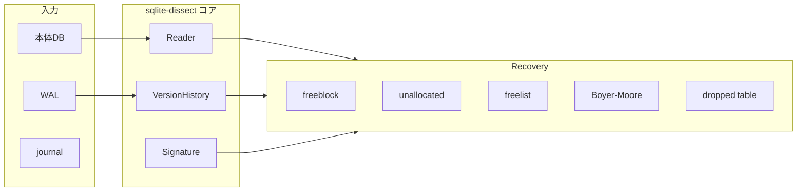

# アルゴリズム概要

ZEUS-DB は SQLite の **論理削除後もディスク上に残るデータ** を、複数のフォレンジック手法で read-only 解析する統合エンジンです。

## なぜ削除レコードが残るか

SQLite は `DELETE` しても、多くの場合 **セル本体のバイト列は即座に消えません**。代わりに次の「死に体領域」に残ります。

| 領域 | 概要 |
|------|------|
| **Freeblock** | 削除セルが freeblock チェーンに載る。先頭4バイトが freeblock ヘッダで上書きされ、第1 serial type が欠損しうる |
| **Unallocated space** | セルポインタ配列とコンテンツ領域の間の隙間。defrag 後の断片もここに |
| **Freelist page** | 再利用待ちページ。過去のレコード断片が残ることがある |
| **WAL (`-wal`)** | 本体 DB に checkpoint されていない最新書き込み |
| **Rollback journal (`-journal`)** | WAL 以前や特殊状況下の変更履歴。**v1 では存在検出とタイムライン注記のみ**（journal からのカービングは未実装） |

## 処理パイプライン

`ForensicEngine.analyze()` は次の順で実行します。

1. **Reader** — 本体 DB + 自動検出した `-wal` / `-journal` を read-only で開く
2. **Version** — WAL フレームをコミット単位の版（version 0, 1, 2…）としてタイムライン化
3. **Live 抽出** — 現存行を b-tree リーフから列挙
4. **Recovery**（`--carve` 時）— freeblock / unallocated / freelist / Boyer-Moore / WAL 版 carve / dropped table
5. **Salvage**（`--salvage` 時）— 破損 DB 向け raw page スキャン
6. **Output** — provenance 付き JSON / TSV / CASE

## Recovery 手法の詳細

### Live 行（現存レコード）

- **対象**: b-tree リーフ上の正式セル
- **実装**: `recover/engine.py` → `aggregate_leaf_cells`
- **algorithm**: `sqlite-dissect-live`
- **confidence**: 1.0

### Freeblock 復元（bring2lite Algorithm 3 概念）

- **対象**: 削除され freeblock 化されたセル領域
- **要点**: レコードヘッダ `[payload_size][rowid][header_size][serial_type…]` の先頭が freeblock ヘッダで上書きされるため、Signature（列型フィンガープリント）で後方からマッチング
- **実装**: `recover/freeblock.py` → `SignatureCarver.carve_freeblocks`
- **algorithm**: `bring2lite-freeblock+sqlite-dissect`
- **confidence**: 0.85

### Unallocated 復元（bring2lite Algorithm 4 概念）

- **対象**: セルポインタ配列とコンテンツ領域の間の隙間
- **要点**: ページヘッダ長・セル数から unallocated 開始/終了を計算し、非ゼロ領域を Signature で解析
- **実装**: `recover/unallocated.py` → `SignatureCarver.carve_unallocated_space`
- **algorithm**: `bring2lite-unallocated+sqlite-dissect`
- **confidence**: 0.80

### Freelist 復元（bring2lite freelist 概念）

- **対象**: freelist trunk / leaf ページ上の断片
- **要点**: `first_freelist_trunk_page_number` から trunk チェーンを辿り、各 leaf の unallocated を carve
- **実装**: `recover/freelist.py`
- **algorithm**: `bring2lite-freelist+sqlite-dissect`
- **confidence**: 0.75

### Boyer-Moore carver（fqlite 概念）

- **対象**: ページ raw bytes 全体（Signature needle がヒットした位置付近）
- **要点**:
  1. テーブル Signature からバイト needle（最大8バイト）を生成
  2. Boyer-Moore bad-character ルールでページ内検索
  3. ヒット位置から `SignatureCarver` でレコード復元
- **実装**: `recover/carver.py`
- **algorithm**: `fqlite-boyer-moore+sqlite-dissect`
- **confidence**: 0.70

### WAL 版 carve（sqlite-dissect VersionHistoryParser）

- **対象**: WAL 各コミット版上の carved_cells
- **要点**: Version 0 = 本体 DB、Version 1..N = WAL コミットレコード。版ごとに freeblock / unallocated / freelist を再 carve 可能
- **実装**: `recover/engine.py` → `VersionHistoryParser`
- **algorithm**: `sqlite-dissect-version-carve`
- **confidence**: 0.90

### Dropped table スキャン（fqlite 概念）

- **対象**: 全ページ raw bytes 中の `CREATE TABLE` SQL 断片
- **要点**: live schema に存在しないテーブル名の手がかりとして記録（行復元ではなくメタデータ）
- **実装**: `recover/dropped_table.py`
- **algorithm**: `fqlite-dropped-table-scan`
- **confidence**: 0.60

### Salvage（undark / sqbrite 概念）

- **対象**: 破損・切断 DB（ヘッダが読めない場合も page_size 推定で試行）
- **要点**: ページ単位の non-zero バイト比率が閾値超なら `__salvage__` 疑似行として記録。行レベル完全復元ではなく「データ残存領域の地図」
- **実装**: `salvage/raw_carver.py`（`--salvage` 時のみ）
- **algorithm**: `undark-sqbrite-raw-page-scan`
- **confidence**: 0.35〜0.50（非ゼロ率に比例。**セル未解析のため上限 0.50**）

## 列値のデコード（TEXT / BLOB）

`recover/convert.py` は sqlite-dissect の **serial type** に基づき列値を正規化します。

- **TEXT**（serial type ≧ 13 かつ奇数）: DB ヘッダのエンコーディング（UTF-8 / UTF-16le / UTF-16be）で復号
- **BLOB**（serial type ≧ 12 かつ偶数）: 生バイトを base64 ラッパー `{"__type__":"blob",...}` で保全（JSON）。TSV では `base64:...` に平坦化
- serial type 不明時: TEXT 復号を試行し、置換文字が多い場合は BLOB として保全

## 論理レコード集約（schema 1.1）

`recover/engine.py` の `finalize_records` が live + deleted + salvage を結合後に集約します。

- **集約キー**: `table_name` + `row_id`（`row_id` なしは列 fingerprint）
- **出力**: 1 論理レコード + `provenances: list[Provenance]`（複数物理出現）
- **重複除去**: 同一 `occurrence_id` の provenance のみマージ

## 決定論的 ID（schema 1.1）

`identity.py` が uuid5 で導出します（ランダム UUID 禁止）。

| ID | 粒度 | 導出 |
|----|------|------|
| `occurrence_id` | 物理出現 | `uuid5(NS, source_sha256\|source\|page\|offset\|version\|row_id)` |
| `record_id` | 論理レコード | `uuid5(NS, source_sha256\|table\|row_id or columns_fingerprint)` |

`metadata.source_sha256`（および WAL/journal ハッシュ）は完全性証明と ID 導出の両方に使用します。同一 DB を再解析すると同一 ID が再現されます。

## confidence 集約規約（schema 1.1）

レコード単位 `confidence` は **`provenances[].source` を正** とします（`is_live` フラグより優先）。

- いずれかの provenance が `live` → レコード confidence = **1.0**
- それ以外 → 各 provenance confidence の **最大値**
- **`is_live` / `is_deleted`**: live provenance が1つでもあれば `is_live=True`, `is_deleted=False`。削除痕は `provenances` に残る。

## Signature（列型フィンガープリント）

削除復元の共通前提。sqlite-dissect が master schema から生成します。

- 各列の **serial type**（INTEGER=1, TEXT=-2 等）の組み合わせパターン
- live 行サンプルから **simplified_signature** を構築
- freeblock では第1 serial type をスキップした regex でマッチング

## Provenance（証拠性メタデータ）

全レコードに付与されます（`models.py`）。

| フィールド | 意味 |
|-----------|------|
| `source` | `live` / `freeblock` / `unallocated` / `freelist` / `carved` / `dropped_table` / `salvage` |
| `algorithm` | 使用した手法の識別子（報告書引用用） |
| `page_number` | ページ番号 |
| `file_offset` | ファイル内オフセット |
| `version` | WAL 版番号（0 = 本体 DB） |
| `confidence` | 出現別信頼度（0.0〜1.0） |
| `occurrence_id` | 物理出現の決定論的 UUID（schema 1.1） |

論理レコードには `record_id`（決定論的 UUID）と集約後 `confidence` があります。
